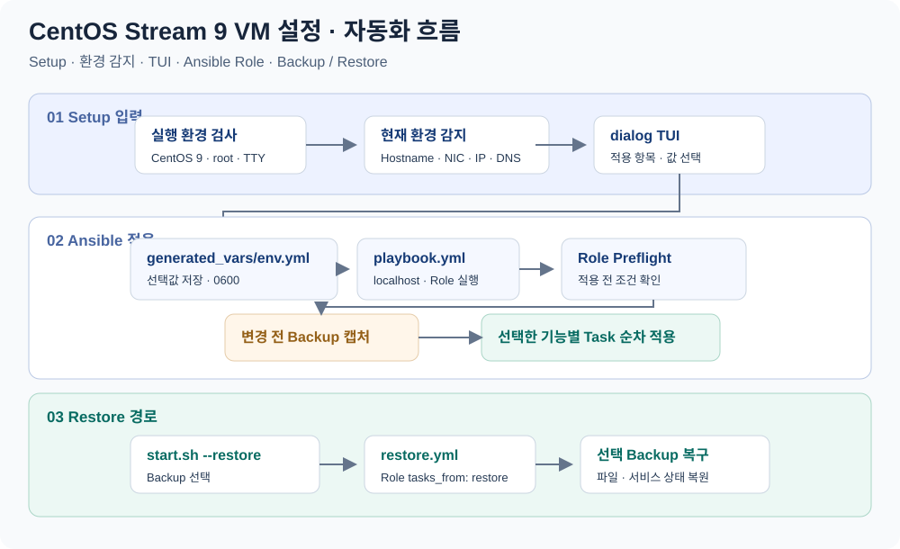
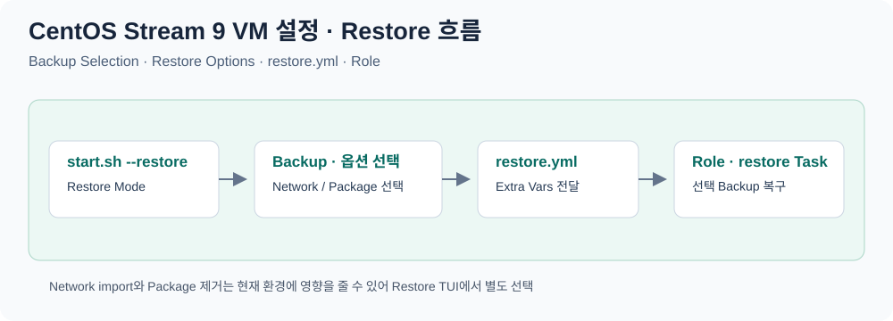

# CentOS Stream 9 실습 VM 환경 설정 자동화

**터미널 설정 화면(TUI)에서 필요한 설정을 선택하면 Bash가 변수 파일을 만들고, Ansible이 현재 VM에 적용한다.**
VMware에서 부팅한 CentOS Stream 9 실습 VM의 네트워크·호스트 설정부터 GNOME·한글 입력·VS Code까지 반복적인 초기 설정을 묶었다.

실행 대상은 [Inventory](inventory)에 정의된 `localhost`다. [start.sh](start.sh)가 사용자 입력을 담당하고, [Ansible Role](roles/cs9_vmware_setup/tasks/main.yml)이 기능별 설정과 변경 전 상태 수집을 담당한다.

## 자동화 흐름

### Setup



기본 실행은 현재 환경을 감지해 TUI 기본값으로 사용하고, 선택 결과를 `generated_vars/env.yml`에 저장합니다. Ansible Role은 Preflight와 변경 전 Backup을 거친 뒤 선택한 기능별 Task를 순서대로 적용합니다. Summary에서 Ansible 실행을 선택하지 않으면 변수 파일만 저장하고 종료합니다.

### Restore



`start.sh --restore`는 기존 Backup을 선택한 뒤 Network 복구와 Package 제거 여부를 별도로 확인합니다. 선택값은 `restore.yml`에 Extra Vars로 전달되고, Role의 `restore` Task가 해당 Backup 기준으로 상태를 복구합니다.

## 주요 구현

- **입력과 적용의 분리:** `dialog` 체크리스트의 선택값을 `generated_vars/env.yml`로 저장한다. 요약 화면에서 확인한 뒤 바로 적용하거나, 변수 파일을 검토하고 나중에 적용할 수 있다.
- **현재 환경을 반영한 입력값:** 호스트명, 활성 네트워크 인터페이스(NIC), NetworkManager 프로필과 IPv4 설정을 조회해 TUI 기본값으로 사용한다.
- **기능별 Task 구성:** 네트워크·보안 설정·데스크톱·개발 도구를 개별 파일로 나누고 변수 조건으로 실행한다. `/etc/hosts`와 쉘 설정은 `blockinfile`의 관리 블록으로 추가한다.
- **현재 상태를 조회한 뒤 변경:** 기본 NIC 설정과 주요 GNOME 값을 비교하고, SSH 키는 파일 존재 여부, VS Code 확장은 설치 목록을 확인해 적용한다.
- **설정 적용과 복구 경로 분리:** 변경 전 파일·서비스 상태를 실행별 디렉터리에 수집하고, 별도 `restore.yml`에서 백업을 선택해 복구한다. 대상 항목은 [백업과 복구](docs/restore.md)에 정리했다.

## 사용 기술과 설정 항목

| 기술 | 적용 역할 |
|---|---|
| Bash · dialog | 실행 환경 검사, 체크리스트·입력창, YAML 변수 파일 생성 |
| Ansible built-in 모듈 | 패키지·서비스·계정·파일 설정과 Task 실행 순서 관리 |
| NetworkManager · nmcli | 기본 NIC의 고정 IPv4 설정, 추가 NIC 연결 생성·설정 |
| systemd · SELinux | 서비스 상태와 실습용 보안 모드 설정 |
| GNOME · gsettings · IBus | 화면 잠금·폰트·입력 소스 설정 |
| VS Code · Microsoft RPM 저장소 | 편집기와 선택한 확장 설치 |

## 저장소 구조

```text
.
├── start.sh                         # TUI 및 적용·복구 진입점
├── inventory                        # localhost, local 연결
├── ansible.cfg                      # Role 경로·권한 상승
├── playbook.yml                     # 설정 적용
├── restore.yml                      # 백업 복구
├── group_vars/all.yml               # 공통 기본값
├── roles/cs9_vmware_setup/
│   ├── defaults/main.yml            # Role 기본값
│   ├── tasks/                       # 기능별 적용·백업·복구
│   └── templates/bashrc_prompt.j2   # PS1 관리 블록
├── generated_vars/                  # 실행 시 env.yml 생성
├── backups/                         # 실행별 백업 저장
└── docs/                            # 설정 및 복구 설명
```

[설정과 실행](docs/configuration.md)에서 선택 항목·변수·점검 명령을, [백업과 복구](docs/restore.md)에서 보관 항목·복구 절차를 확인할 수 있다.

## 실행 흐름

| 단계 | 처리 |
|---|---|
| 실행 준비 | CentOS Stream 9·root·대화형 터미널 검사, 부족한 bootstrap 패키지 설치 |
| 설정 선택 | 현재 환경 조회 → 적용 항목 선택 → 기본값 사용 또는 세부값 입력 |
| 변수 저장 | `generated_vars/env.yml` 생성, 권한 `0600` 적용, 선택 요약 표시 |
| 설정 적용 | 사용자가 실행을 선택하면 preflight → 백업 → 기본 패키지 및 기능별 Task 실행 |
| 적용 후 | 선택한 설정 확인, 필요 시 수동 재부팅 또는 별도 복구 실행 |

## 실행 조건

- **VM 환경:** 부팅된 CentOS Stream 9, DNF 저장소에 접근 가능한 초기 네트워크, root 또는 sudo 권한, UTF-8 대화형 터미널.
- **데스크톱 설정:** GNOME 세션이 있는 환경에서 사용한다. 현재 Task는 root로 실행되므로 GNOME 설정도 해당 사용자의 세션을 기준으로 한다.
- **네트워크 변경:** 연결을 다시 활성화하므로 VMware 콘솔에서 진행한다. `NETWORK`를 선택하면 감지한 주소를 사용하더라도 IPv4 방식을 `manual`로 설정한다.
- **백업 생성:** 현재 코드에는 백업 대상 파일이 없을 때 메타데이터 작성이 실패하는 조건이 있다. 적용 전 [백업 파일 조건](docs/restore.md#백업-파일-조건)을 확인한다.

TUI의 기본 선택에는 firewalld 중지·비활성화와 SELinux permissive가 포함된다. 적용할 항목은 체크리스트에서 조정한다.

## 실행

VM 안의 터미널에서 실행한다.

```bash
git clone https://github.com/tjung03/centosstream9-vmware-setup.git
cd centosstream9-vmware-setup
sudo ./start.sh
```

1. `Setup Modules`: `SPACE`로 선택·해제하고 `ENTER`로 진행한다.
2. `Default Values`: `Yes`는 감지값·기본값 사용, `No`는 선택 항목의 세부값 입력이다.
3. `Summary`: 대상 주소·선택 항목·백업 경로를 확인한다.
4. `Run Ansible`: `Yes`는 적용, `No`는 변수 파일을 저장하고 종료한다.

`REBOOT`는 기본 미선택 상태로 사용한다. 기본 local 연결에서는 `ansible.builtin.reboot`가 실행을 거부하므로, 필요한 재부팅은 설정 확인 후 수동으로 진행한다. [재부팅 설명](docs/configuration.md#재부팅)

변수 파일을 먼저 생성한 경우, 같은 저장소 루트에서 적용한다.

```bash
sudo ansible-playbook -i inventory playbook.yml -e @generated_vars/env.yml
```

복구는 생성된 백업을 선택해 실행한다.

```bash
sudo ./start.sh --restore
```

## 설정 확인

선택한 항목에 맞춰 현재 상태를 조회한다.

```bash
hostnamectl --static
nmcli device status
nmcli connection show --active
ip -4 address
ip route
getenforce
systemctl is-active firewalld
systemctl is-enabled firewalld
```

firewalld 중지·비활성화를 선택했다면 `inactive`·`disabled`, 실행 중 SELinux를 permissive로 전환했다면 `Permissive`가 확인값이다. GNOME·VS Code와 설정 파일 확인은 [항목별 확인 방법](docs/configuration.md#설정-확인)에 정리했다.

## 버전과 호환성

패키지는 DNF 저장소에서 버전을 고정하지 않고 설치한다. 실제 환경의 버전은 다음 명령으로 확인할 수 있다.

```bash
ansible --version
python3 --version
nmcli --version
rpm -q ansible-core NetworkManager gnome-shell code
```

| 코드의 사용 항목 | 현재 공식 기준 |
|---|---|
| `ansible.builtin.systemd_service` | 현재 systemd 서비스 관리 모듈명. `systemd`도 별칭으로 제공 |
| Microsoft RPM 저장소 | 코드의 VS Code 저장소 URL·GPG 키는 현재 공식 설치 안내와 일치 |
| `/etc/selinux/config`의 `SELINUX=disabled` | RHEL 9 계열의 완전 비활성화 안내는 커널 인자 `selinux=0` 방식. 이 Role은 설정 파일과 런타임 permissive 전환을 처리 |

공식 문서 확인일: **2026-09-05**. [systemd_service](https://docs.ansible.com/projects/ansible/latest/collections/ansible/builtin/systemd_service_module.html) · [VS Code Linux 설치](https://code.visualstudio.com/docs/setup/linux) · [SELinux 상태 변경](https://docs.redhat.com/en/documentation/red_hat_enterprise_linux/9/html/using_selinux/changing-selinux-states-and-modes_using-selinux)

작성자: tjung03
